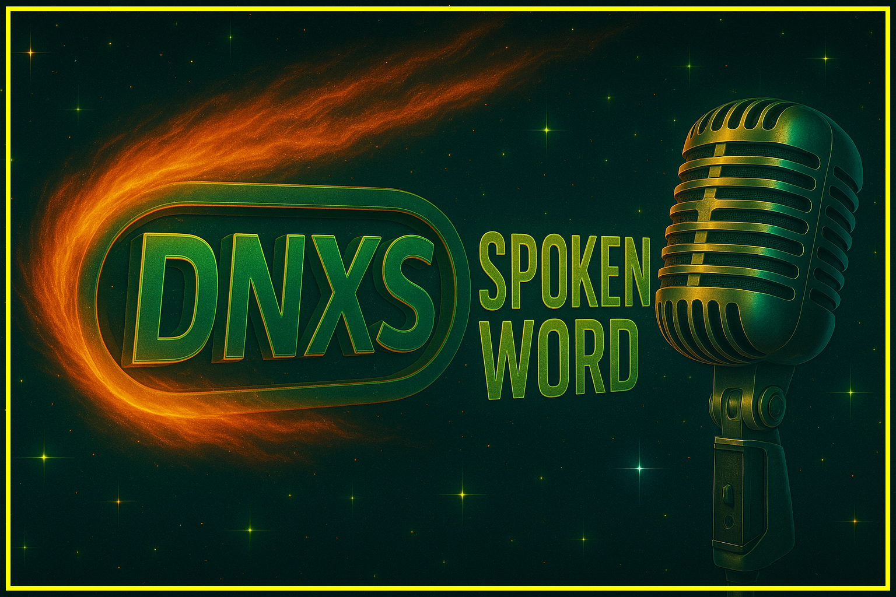
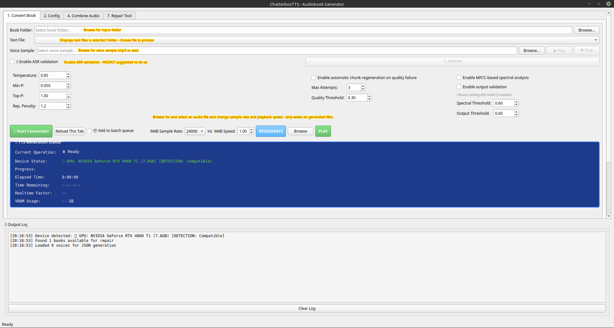
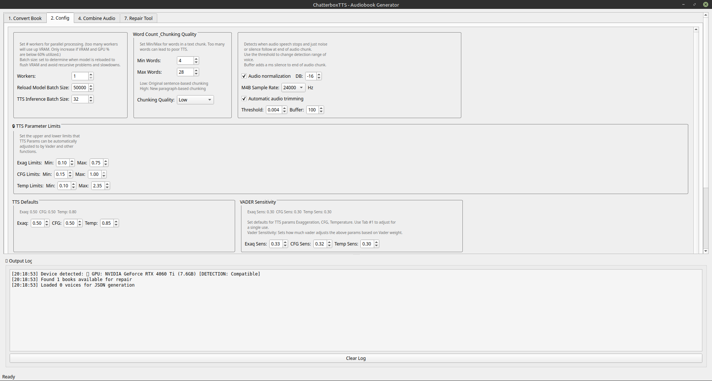
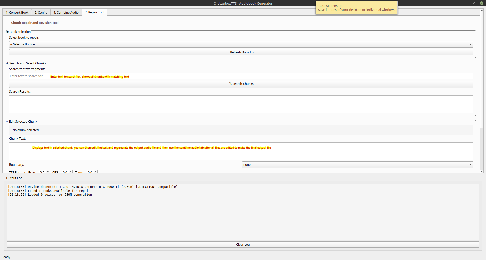

# DNXS Spokenword ChatterboxTTS FLASH



**Open-source audiobook production system built on Resemble AI's Chatterbox Turbo.**

Turn raw text into professional M4B audiobooks with voice cloning, ASR validation,
intelligent chunking, and quality control — all running locally on your GPU.

---

## Overview

ChatterboxTTS is a high-performance text-to-speech pipeline designed for audiobook
production. It wraps Resemble AI's Chatterbox Turbo model (350M parameters, 1-step
decoder) in a modular system that handles everything from raw text input to
finished audiobook files with chapters, cover art, and metadata.

The system features voice cloning from short audio samples, VADER sentiment analysis
that dynamically adjusts TTS parameters per chunk, optional ASR validation using
faster-whisper, and intelligent resume from interruptions. Both a PyQt5 GUI and a
full-featured CLI are provided.

## Features



- **TTS Engines** — S3Gen and T3 (Chatterbox Turbo) with FP16/TF32 mixed precision

- **Voice Cloning** — clone any voice from a short audio sample

- **Smart Chunking** — text split at sentence boundaries, respects abbreviation lists

- **ASR Validation** — faster-whisper checks output quality with configurable similarity thresholds

- **Audio Quality Control** — clipping, hum, flatness detection; automatic normalization to target LUFS

- **M4B Packaging** — final audiobook output with chapters, cover art, and metadata via ffmpeg

- **Interactive Chunk Editing** —  suite for editing, regenerating, and previewing individual chunks

- **GPU/CPU Support** — auto-detects CUDA version and installs matching PyTorch

- **torch.compile Optimization** — optional model compilation for faster inference

- ****increased speed- **** On Nvidia 4060Ti avgs 5-6X (250it/s)

- 





## Requirements

- Python 3.10+
- NVIDIA GPU with CUDA (recommended; CPU-only mode is supported)
- `python3-venv` package (for virtual environment creation)

## Installation

### Automated (Recommended)

The installer creates a virtual environment, installs `requirements.txt`, and
lets model checkpoints download on first run:

```bash
chmod +x install.sh
./install.sh
```

After install, edit `.env` and add your Hugging Face token. The first run will
download model weights into your local cache.

### Manual

```bash
python3 -m venv venv
source venv/bin/activate
pip install -r requirements.txt
```

### Windows

```
ChatterboxTTS-Setup-1.0.0.exe
```

****IMPORTANT: after running install. There will be a .env File created. You must edit this file and add your Hugging Face token. On first run of the program, the chatterbox model will be downloaded from Huggingface. It will fail without this token.

## Running the Application

### GUI (Recommended for most users)

```bash
./0.sh (linux)
or manual mode:
source venv/bin/activate
python3 chatterbox_gui.py
launcher.pyw (windows - or use menu launcher)
```

The launcher activates the virtual environment, checks for CUDA mismatches, and
starts the PyQt5 GUI. You can also launch directly:

```bash
source venv/bin/activate
python3 chatterbox_gui.py
```

Models are downloaded automatically from HuggingFace on first run.

### Shareable Bundle

To build a compressed source bundle with only runtime files:

```bash
chmod +x build/create_distribution.sh
./build/create_distribution.sh
```

## 

## License

Based on [Chatterbox TTS by Resemble AI](https://github.com/resemble-ai/chatterbox).
See [pyproject.toml](pyproject.toml) for package metadata and upstream licensing.
